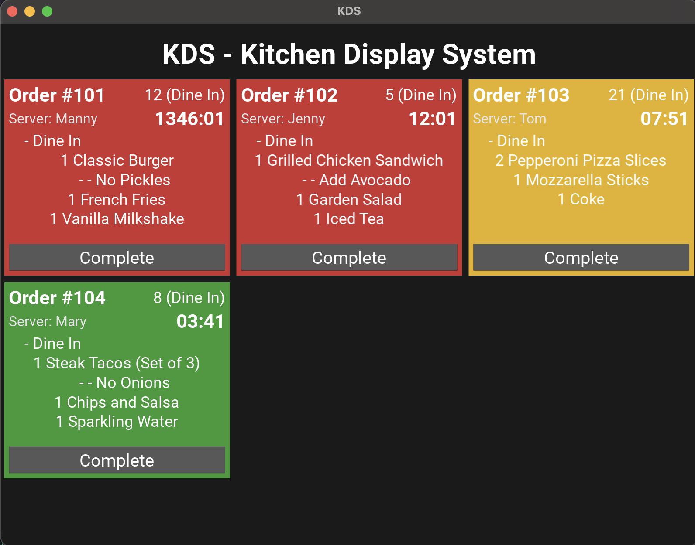

# KDS-Portfolio: Kitchen Display & Printer Emulator


## Overview
The **KDS-Portfolio** is a production-ready software suite designed to modernize restaurant operations. It features a TCP network printer emulator that seamlessly intercepts raw print payloads from legacy Point of Sale (POS) systems, coupled with a responsive, graphical Kitchen Display System (KDS) built in Kivy. This project demonstrates expertise in network programming, file-based asynchronous processing, and UI development.

## The Ecosystem Context
In a typical hospitality technology stack, integrating modern visual systems with legacy POS software can be difficult due to proprietary protocols. This project bridges that gap without modifying the POS:
- **Interceptor:** The `printer.py` module acts as a "virtual printer" on the network (port 9100), capturing raw data and saving it to a local queue.
- **Visualizer:** The `kds.py` graphical interface continuously polls this queue, parses the text into actionable order tickets, and manages the lifecycle of the meal preparation.

## Visuals

*Figure 1: The main Kitchen Display interface showing live orders with color-coded SLA timers (Green/Yellow/Red).*

## Key Features
- **Legacy POS Integration:** Emulates a standard TCP receipt printer to seamlessly capture data without POS modifications.
- **Asynchronous File Polling:** Uses a decoupled file-based queue (`print_output` directory) ensuring the UI never blocks while receiving orders.
- **Intelligent Order Parsing:** Extracts critical metadata (Order ID, Table, Server, Timestamp, Items) from raw unstructured text.
- **Visual SLA Timers:** Tickets automatically transition from Green to Yellow to Red based on configurable wait-time thresholds.
- **Cross-Platform GUI:** Built with the Kivy framework, making the KDS display runnable on Windows, macOS, Linux, and touch-enabled tablets.

## Tech Stack
- **Languages:** Python 3.x
- **Networking:** Native Python `socket` and `threading` libraries
- **GUI Framework:** Kivy
- **Configuration:** `python-dotenv`

## Getting Started

### Local Setup
1. **Clone the repository:**
   ```bash
   git clone https://github.com/your-username/kds_portafolio.git
   cd kds_portafolio
   ```

2. **Create a virtual environment:**
   ```bash
   python -m venv venv
   source venv/bin/activate  # On Windows: venv\Scripts\activate
   ```

3. **Install dependencies:**
   ```bash
   pip install -r requirements.txt
   ```

4. **Environment Configuration:**
   Copy the example environment file and adjust the ports/directories if needed.
   ```bash
   cp .env.example .env
   ```

## Usage / API Reference

This system runs as two concurrent processes:

**1. Start the Printer Emulator:**
Listens for inbound POS traffic on port 9100.
```bash
python src/printer.py
```

**2. Start the Kitchen Display System (KDS):**
Launches the Kivy graphical interface.
```bash
python src/kds.py
```

**Testing:**
You can simulate a POS sending a print job using `netcat` from another terminal:
```bash
cat tests/sample_order.txt | nc 127.0.0.1 9100
```
*The KDS UI will instantly populate with the new order ticket.*

## License
This project is licensed under the MIT License - see the [LICENSE](LICENSE) file for details.
